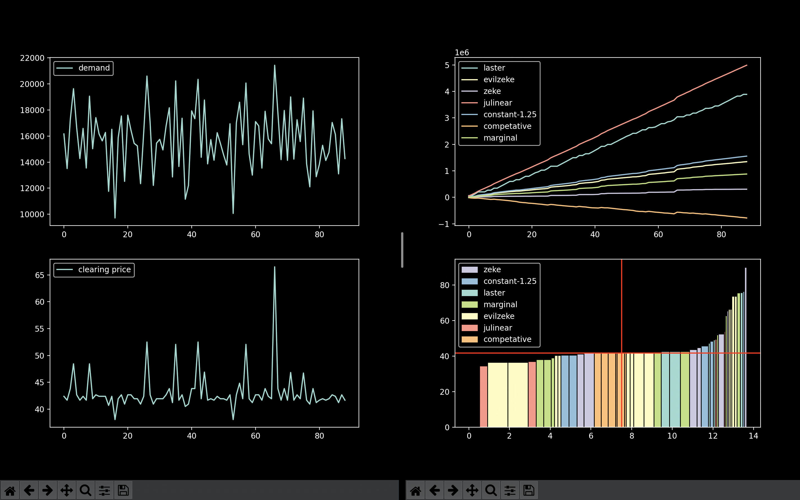

# Power Game

In 2000 and 2001 California experienced multiple large-scale blackouts
and skyrocketing energy prices as the result of market manipulation in
the energy spot market. The energy spot market is where power
distributors like PG&E purchase power for use immediately. More or
less it works like this:

1. PG&E determines that it needs X amount of power for the current
   hour.
2. PG&E sends that information to power generation companies and those
   companies make bids for each of their power plants. A bid consists
   of the amount of power that plant has avaliable and the price for
   that power.
3. PG&E sorts the bids it receives and puts them in a stack with the
   cheapest ones on top of the stack and the most expensive on the
   bottom.
4. Starting from the top of the stack, PG&E pops bids off the stack
   until the energy demand for that hour is met.
5. The price per unit energy of the bid that was removed last is the
   _clearing price_. For each bid that PG&E has received they pay that
   supplier the clearing price for their energy.
   
Any plant that does not get popped from the stack doesn't make any
money. Suppliers that want to maximize their profit then want to do
two things:

1. Maximize the clearing price so that the energy that they supply is
   purchased at top dollar.
2. Maximize the number of their plants that have bids under the
   clearing price.
   
This program simulates this energy market using real power plants from
the state of California and randomly generated demand based on the
distribution of previous demand levels in California. At the beginning
of each round each player is randomly assigned a group of power plants
and then they compete to make the most money using those
plants. Running a large number of rounds we can start to compare
different stragegies and gain some insights about what stragegies are
effective in making money and boosting clearing prices.

# Using This Program

In order to add a player you'll need to make a player class and add it
to the game. `main.py` is reasonably well commented and starting from
there it shouldn't be too difficult to work out how to do that.
